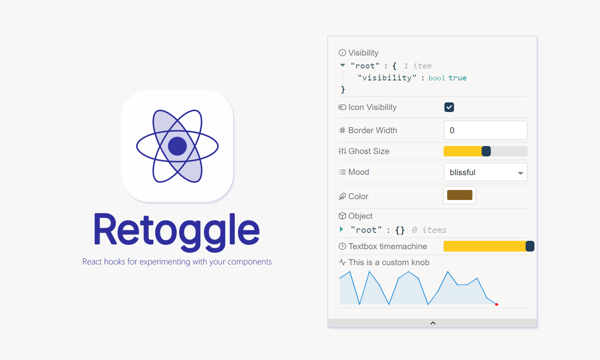

<div  align="center">

<br />
<br />


</div>

<br />

Retoggle is a collection of React hooks which provides UI toggles to manipulate your component state from outside. Like [Storybook Knobs](https://www.npmjs.com/package/@storybook/addon-knobs). This library is inspired by [ideas from Dan Abramov](https://twitter.com/dan_abramov/status/1058834904207761409).

- 🎉 A wide range of toggles
- 💡 Frictionless integration
- 🎨 Themeable components
- 🎁 Extensible. Write your custom toggles.

> 🚨 You need React v16.7.0 to use Retoggle since it relies on Hooks. Also Hooks are a new feature proposal that lets you use state and other React features without writing a class. They’re currently in React v16.7.0-alpha and [being discussed in an open RFC.](https://github.com/reactjs/rfcs/pull/68)

### Available knobs

- 📝 `useLog()` - Keeps track of a variable value
- 🅰 `useTextKnob()` - Shows a text box
- 1️⃣ `useNumberKnob()` - Shows a number box
- ✅️ `useBooleanKnob()` - Shows a check box
- 🎚 `useRangeKnob()` - Shows a slider
- 🎛 `useRangesKnob()` - Shows multiple sliders
- 🎏 `useSelectKnob()` - Shows a select box
- ⚒ `useObjectKnob()` - Shows an object editor
- 🎨 `useColorKnob()` - Shows a color picker
- ⏰ `useTimemachine()` - Shows a slider and tracks the state of a given variable and allows to travel back in time

#### 📚 [API Docs with live preview available here](https://retoggle.debuggable.io)

#### 🔮 [Codesandbox Demo](https://codesandbox.io/s/kw21kn3063)

### An example

The value of `state` will be displayed in the inspector component.

```javascript
import React, { useState } from "react";
import { Inspector, useLog } from "retoggle";

export default function Demo() {
  const [state, setState] = useState({ value: 5 });

  // logs your state to inspector
  useLog("My state", state);

  return (
    <div>
      <Inspector />
    </div>
  );
}
```

### Contribute

Preparing dev environment

- `yarn install` to install dev dependencies

Running and building the library

- `yarn start` will start the dev server and expose the sample app
- `yarn build` will output the build artifact to `./lib` folder

Docs

- `docz:dev` will start the docz developement server
- `docz:build` will build the docs

### License

MIT

### Contributors

  <!-- ALL-CONTRIBUTORS-LIST:START - Do not remove or modify this section -->

| [<br /><sub>Raathigeshan</sub>](https://twitter.com/Raathigesh)<br />💻 📖 💬 👀 🤔 🎨 |
| :--------------------------------------------------------------------------------------------------------------------------------------------------------------------------: |


<!-- ALL-CONTRIBUTORS-LIST:END -->

This project follows the [all-contributors](https://github.com/kentcdodds/all-contributors) specification.
Contributions of any kind are welcome!
